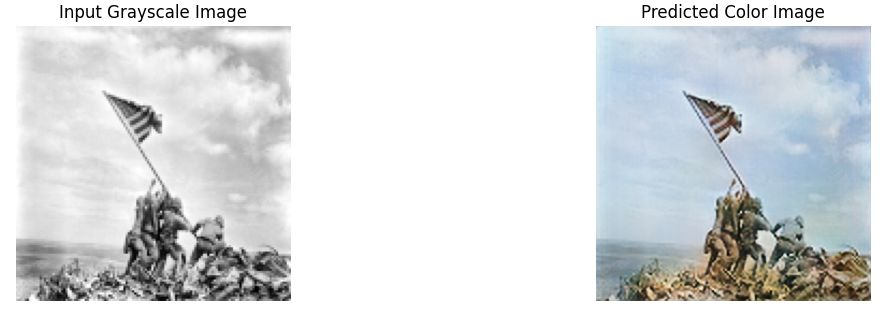

Historical black-and-white photographs are highly valued for their creative and artistic significance.
However, their lack of color limits the vividness of the original scenes. The process of colorizing black-and-white photographs profoundly transforms the viewer’s perspective,
effectively bridging the temporal divide between past and present and enhancing the images’ relevance. Nevertheless, the accurate reconstruction of original colors remains a
significant challenge, as reliable references to the authentic hues of early photographs are often unavailable.
This paper proposes a solution to this issue, with the aim of providing an automatic way of re-coloring historical images and reconstructing their visual quality using
deep learning and image re-construction techniques. To reach such objectives, we compare different Computer Vision architectures and strategies:
a vanilla U-Net model, a Fusion Model combining a U-Net with the pre-trained segmentation model DeepLabV3+, and a GAN architecture implementing the U-Net as generator.

The notebooks provided show the architectures, the training and the predictions using each of the three models. Moreover, at the end of each, you may find a zero-shot inference 
performed on true historical images with no colored counterpart. 
The .npy file caches the image filepaths to speed up the running of the each notebook by about 12/15 minutes.

